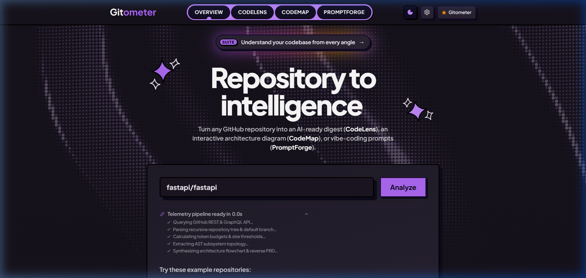
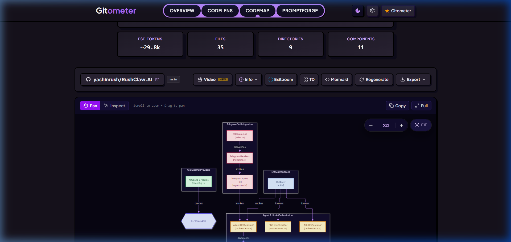
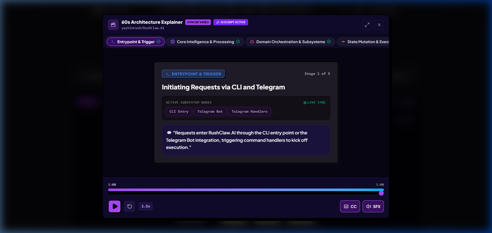
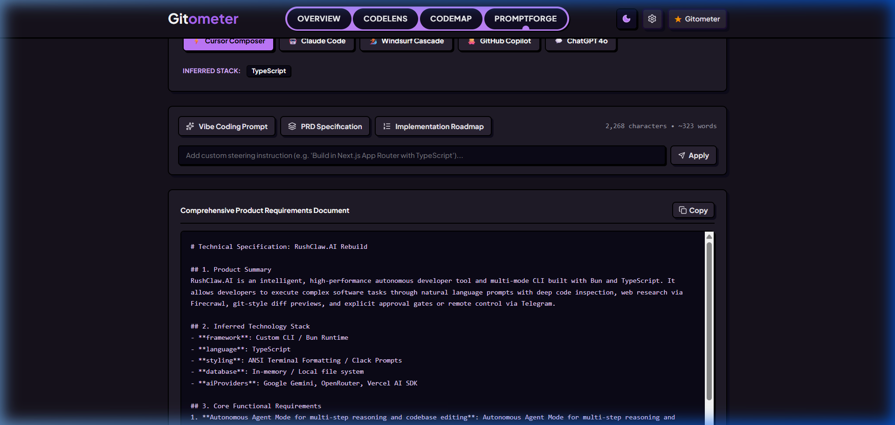
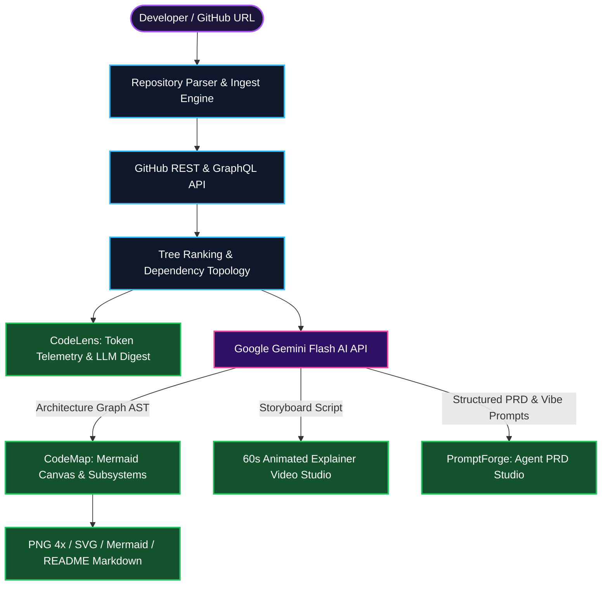

# 📐 Gitometer

<p align="center">
  
</p>

<p align="center">
  <strong>Understand your codebase from every angle — in seconds.</strong><br />
  Transform any GitHub repository into an AI-ready digest (<strong>CodeLens</strong>), an interactive architecture diagram with a synchronized 60-second animated video (<strong>CodeMap</strong>), or production PRDs and vibe-coding prompts (<strong>PromptForge</strong>).
</p>

<p align="center">
  <a href="https://github.com/yashinrush/gitometer/blob/main/LICENSE"></a>
  <a href="https://react.dev/"></a>
  <a href="https://www.typescriptlang.org/"></a>
  <a href="https://vite.dev/"></a>
  <a href="https://ai.google.dev/"></a>
  <a href="https://mermaid.js.org/"></a>
  <a href="https://tailwindcss.com/"></a>
</p>

---

## ⚡ What is Gitometer?

Developers spend over 60% of their time reading unfamiliar code, untangling subsystem dependencies, and formatting prompt dumps for AI coding assistants. 

**Gitometer** solves this by unifying 3 developer intelligence workflows into a single high-performance web platform:

1. **CodeLens (LLM Prompt Ingestion)**: Ingests repositories, strips dependency noise, and calculates token budgets for ChatGPT, Claude, and Gemini.
2. **CodeMap (Interactive Architecture & 60s Video Explainer)**: Compiles live Mermaid architecture flowcharts with subsystem groupings, pan-zoom controls, clickable node drawers, and a synchronized 60-second animated video explainer studio with live Gemini AI narration.
3. **PromptForge (Reverse PRD & Vibe Coding)**: Reverse-engineers technical specifications, inferred tech stacks, and step-by-step prompts tailored for **Cursor Composer**, **Claude Code**, and **Windsurf Cascade**.

---

## 📸 Output Gallery & Visual Showcase

### 1. Interactive Architecture Diagram (CodeMap)
> *Interactive Mermaid architecture graph with color-coded subsystem boundaries (`toneBlue`, `toneAmber`, `toneRose`, `toneMint`), grab-and-drag canvas panning, mouse-wheel zooming, and floating PanZoom pill controls.*

<p align="center">
  
</p>

---

### 2. 60-Second Architecture Explainer Video Studio (GitDiagram Parity)
> *Synchronized 5-stage animated video explainer with active node highlighting, subtitle captions, 1x–2x playback speed switching, Web Audio sound effects, and live Gemini AI narration synthesis.*

<p align="center">
  
</p>

---

### 3. PromptForge PRD & Agent Prompt Synthesizer
> *Reverse-engineered Product Requirements Document (PRD), architectural data models, inferred technology stack, and natural-language vibe prompts.*

<p align="center">
  
</p>

---

## 🚀 Key Features & Capabilities

### 🗺️ CodeMap Engine (GitDiagram Parity)
- **Fluid Pan & Zoom Canvas**: Full grab-and-drag panning, mouse-wheel zooming, and a floating toolbar with `-`, `%`, `+`, and **`Fit`** diagram auto-centering.
- **Subsystem Tone Classes**: Nodes and groups are styled with calibrated neo-brutalist tones (`toneBlue`, `toneAmber`, `toneMint`, `toneRose`, `toneIndigo`) for instant visual hierarchy.
- **Node Inspector Drawer**: Click any node on the graph to slide open an inspector revealing incoming callers, outgoing calls, file path badges, and direct links to GitHub source code.
- **60s Animated Explainer Video**:
  - 5-stage synchronized walkthrough of the repository architecture.
  - Dynamic active-node highlighting with glowing live badges.
  - Multi-speed playback (`1x`, `1.25x`, `1.5x`, `2x`), scrubber, and play/pause controls.
  - Built-in Web Audio API sound effects for stage transitions and chimes.
  - **Gemini AI Script Button**: Generate live voiceover and storyboards with one click.
- **Multi-Format Export Suite**:
  - **4x High-Res PNG**: Crystal-clear raster export with dark background and Gitometer watermark.
  - **Vector SVG**: Clean vector graphic with embedded stylesheets.
  - **Mermaid Source**: View and copy raw Mermaid syntax.
  - **README Markdown**: Ready-to-paste markdown picture blocks and badges for GitHub repositories.

### 🔍 CodeLens Engine (Context Ingestion)
- **Token Telemetry**: Live calculation of tokens, file counts, and directory depth before copying to clipboard.
- **Smart Filtering**: Wildcard include/exclude patterns (`*.ts`, `!*.lock`, `!dist/**`) to bypass binary bloat.
- **Formatted LLM Dumps**: Single-click copy or `.txt` download formatted specifically for Claude 3.7 Sonnet, ChatGPT-4o, and Gemini 2.5 Flash.

### ✨ PromptForge Engine (Reverse PRD)
- **Inferred Tech Stack**: Automatically identifies frameworks, runtimes, UI systems, and databases.
- **Conversational Vibe Prompts**: Casual, outcome-focused agent prompts designed for Cursor, Windsurf, and Claude Code.
- **Comprehensive PRD**: Complete technical specifications covering core functional requirements, user flows, and folder structure.
- **Phased Implementation Roadmap**: Step-by-step checklist from scaffolding to production deployment.

---

## 🛠️ System Architecture



---

## 💻 Tech Stack

| Layer | Technologies |
| :--- | :--- |
| **Framework** | [React 19](https://react.dev/) + [Vite 6](https://vite.dev/) |
| **Language** | [TypeScript 5.7](https://www.typescriptlang.org/) |
| **Styling** | [Tailwind CSS 3.4](https://tailwindcss.com/) with Neo-Brutalist Obsidian tokens |
| **Diagram Engine** | [Mermaid.js 11.4](https://mermaid.js.org/) + DOMPurify SVG sanitization |
| **AI Integration** | [Google Gemini Flash](https://ai.google.dev/) (`gemini-flash-lite-latest`, `gemini-3.5-flash-lite`) |
| **Audio Engine** | Web Audio API (real-time synthesized UI foley and transition chimes) |
| **Icons & UI** | [Lucide React](https://lucide.dev/) + [Hugeicons](https://hugeicons.com/) |

---

## 🏁 Getting Started

### 1. Prerequisites
- **Node.js** 20.x or higher
- **npm**, **yarn**, or **pnpm**
- *(Optional)* Google Gemini API Key ([Get one at Google AI Studio](https://aistudio.google.com/))

### 2. Clone and Install
```bash
git clone https://github.com/yashinrush/gitometer.git
cd gitometer
npm install
```

### 3. Configure Environment Variables
Create a `.env.local` file in the project root:
```env
# Google Gemini API Key for live AI architecture synthesis and video explainer generation
VITE_GEMINI_API_KEY=your_gemini_api_key_here

# Optional: GitHub Personal Access Token to increase API rate limits (60/hr -> 5,000/hr)
VITE_GITHUB_TOKEN=your_github_token_here
```

> **Note**: You can also enter or update your Gemini API key and GitHub Token directly in the application UI via the **Settings (⚙️)** modal. Settings are persisted safely in your browser's `localStorage`.

### 4. Run Development Server
```bash
npm run dev
```
Open **[http://localhost:5174](http://localhost:5174)** in your browser.

### 5. Build for Production
```bash
npm run build
```

---

## ⌨️ Interactive Controls & Shortcuts

| Action | Control |
| :--- | :--- |
| **Pan Diagram** | Left-click and drag anywhere on the canvas |
| **Zoom Diagram** | Mouse wheel scroll or `+` / `-` buttons on floating toolbar |
| **Reset / Fit Diagram** | Click the **`Fit`** button in the floating PanZoom pill |
| **Inspect Node** | Click on any diagram node to view callers, callees, and GitHub path |
| **Toggle Fullscreen** | Click the **`Full`** button in the canvas header or press `Esc` to exit |
| **Change Layout Direction** | Click the **`TD`** (Top-Down) / **`LR`** (Left-Right) toggle button |
| **Export High-Res PNG** | Click **Export** → **PNG Image** (renders with 4x crisp DPI) |
| **Launch 60s Video** | Click **Video NEW** on the toolbar to open the Explainer Studio |

---

## 📄 License

This project is licensed under the [MIT License](LICENSE).
